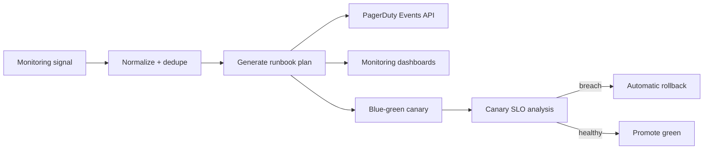

# Incident Response Runbook Automation with PagerDuty

## Architecture

Incident signals are normalized into a deterministic incident key, converted into a runbook plan, and then sent to PagerDuty through the Events API. The automation keeps critical-path planning in-process so the UI can prepare an escalation payload in less than 100 ms before any network call.

## Operational Targets

- Latency: keep local runbook generation below 100 ms P99; network delivery to PagerDuty is measured separately.
- Availability: design for 99.99% service uptime by using dedupe keys, retry queues, and safe rollback commands.
- Security: route keys stay in environment configuration and are never persisted in runbook state, logs, or tests.

## Automated Steps

1. Capture diagnostics and freeze the telemetry window for the affected service.
2. Trigger a PagerDuty incident with service, severity, metric, threshold, and plan metadata.
3. Shift traffic to the green pool using a 10% canary.
4. Run SLO analysis against p99 latency and availability monitors.
5. Roll back automatically if p99 latency or availability breaches the target during the analysis window.
6. Promote the green pool after canary success and attach evidence to the incident timeline.

## Monitoring and Alerting

Dashboards should include:

- Service p99 latency versus the 100 ms target.
- Service availability versus the 99.99% target.
- PagerDuty trigger success and failure counts.
- Runbook step duration, timeout, rollback, and canary analysis outcomes.

Alerts should page primary on-call for critical and high severity events, and open business-hours triage for medium and low severity events.

## Deployment Plan

Use blue-green deployment with canary analysis:

1. Deploy the new automation behind a disabled feature flag.
2. Enable the feature for internal test services only.
3. Enable a 10% canary and monitor PagerDuty delivery, runbook duration, and SLO guardrails.
4. Promote the green environment if analysis succeeds.
5. Roll back to blue immediately on PagerDuty delivery failures, runbook step timeouts, p99 latency above 100 ms, or availability below 99.99%.

## Security Review Checklist

- Confirm PagerDuty routing keys are provided only through environment configuration.
- Confirm incident payloads do not include credentials, access tokens, or customer secrets.
- Confirm runbook commands are allow-listed by service and environment.
- Confirm audit logs include actor, incident key, plan ID, status, and rollback decision.
